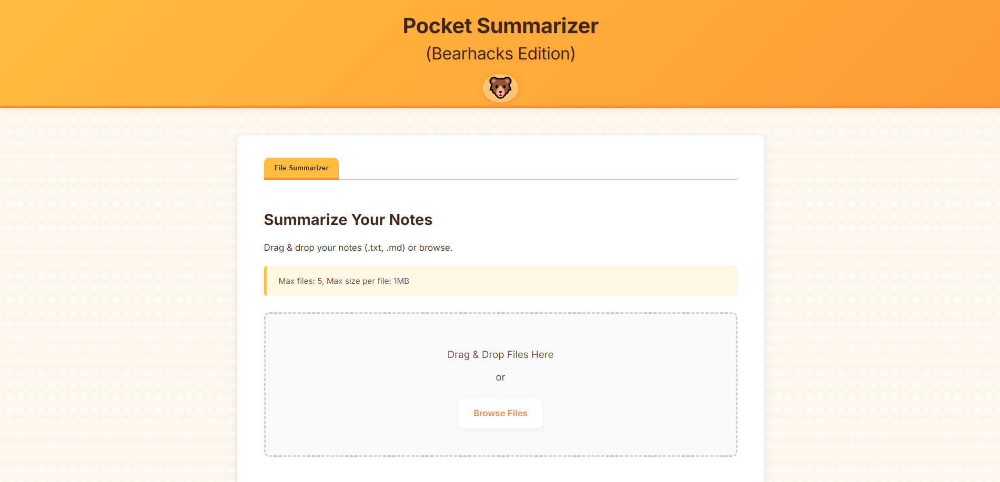

# Pocket Summarizer (Bearhacks Edition)

A polished web application built with Flask that offers powerful AI-powered file summarization. This tool leverages the Perplexity AI API (using `r1-1776` models) to generate high-quality, readable summaries from text files.



## Features

### Core Functionality
-   **Multi-file Summarization:** Upload and summarize multiple `.txt` and `.md` files simultaneously.
-   **Adjustable Detail Levels:** Choose between "Short", "Medium", or "Comprehensive" summaries for the final output.
-   **Asynchronous Processing:** File processing and summarization run in the background, keeping the user interface responsive.
-   **Live Progress Updates:** Real-time status updates are provided during processing via Server-Sent Events (SSE).

### User Experience
-   **Modern Interface:** Clean, intuitive design with drag-and-drop file uploads.
-   **Multiple Output Views:** View the generated summary as rendered Markdown or as raw text.
-   **Convenient Actions:** Easily copy the raw summary text or download it as a `.txt` file.
-   **Responsive Design:** Adapts to different screen sizes.
-   **Theme Toggle:** Includes a theme toggle button in the header for an alternate viewing experience.

### Technical Highlights
-   **Flask Backend:** Robust backend handling requests, background tasks, and SSE.
-   **Vanilla JavaScript Frontend:** No heavy frontend frameworks, ensuring lightweight performance.
-   **Real-time Updates:** Uses Flask-SSE with a Redis backend.
-   **Background Tasks:** Utilizes Python's built-in `threading` module for asynchronous operations.
-   **Modular Utilities:** Code organized into utility modules for file handling, Perplexity API interaction, and GitHub API interaction.

## Tech Stack

-   **Backend:** Python 3, Flask
-   **Frontend:** HTML, CSS, Vanilla JavaScript
-   **AI:** Perplexity API (via `openai` library, using `r1-1776` models)
-   **Asynchronous Operations:** Python `threading`, Flask-SSE (requires Redis)
-   **Session/Task Management:** Flask-Session (filesystem), In-memory Python dictionary for task results
-   **API Interaction:** `requests` (for GitHub utilities)
-   **Dependencies:** `python-dotenv`, `Markdown`, `redis`

## Setup and Installation

### Prerequisites
-   Python 3.8+
-   Redis Server (for SSE real-time updates)
-   Perplexity AI API Key

### Installation Steps

1.  **Clone the repository:**
    ```bash
    git clone <your-repository-url>
    cd pocket-summarizer
    ```

2.  **Set up a virtual environment:**
    ```bash
    python -m venv venv
    source venv/bin/activate  # On Windows: venv\Scripts\activate
    ```

3.  **Install dependencies:**
    ```bash
    pip install -r requirements.txt
    ```

4.  **Configure and start Redis:**
    *   **Docker (Recommended):** `docker run -d -p 6379:6379 --name pocket-summarizer-redis redis`
    *   **macOS:** `brew install redis && brew services start redis`
    *   **Linux (Debian/Ubuntu):** `sudo apt update && sudo apt install redis-server`
    *   **Windows:** Download and run from [microsoftarchive/redis releases](https://github.com/microsoftarchive/redis/releases).

5.  **Configure Environment Variables:**
    *   Copy `.env.example` to `.env`.
    *   Open the `.env` file and add your Perplexity API key:
        ```
        PERPLEXITY_API_KEY=your_perplexity_api_key_here
        ```
    *   Generate and add a Flask secret key:
        ```bash
        # Run this command in your terminal
        python -c 'import secrets; print(secrets.token_hex(24))'
        ```
        Copy the output and add it to your `.env` file:
        ```
        FLASK_SECRET_KEY=your_generated_secret_key_here
        ```
    *   Ensure `REDIS_URL` in `.env` points to your Redis instance (default is `redis://localhost:6379/0`).

## Usage

1.  **Start the application:**
    ```bash
    flask run
    # Or
    python app.py
    ```

2.  **Access the application:** Open your web browser and navigate to `http://127.0.0.1:5000`.

3.  **Summarize Files:**
    *   Use the "File Summarizer" tab.
    *   Drag and drop `.txt` or `.md` files onto the upload area, or click "Browse Files".
    *   Select the desired summary detail level (Short, Medium, or Comprehensive).
    *   Click "Summarize Files".
    *   Observe the real-time progress updates.
    *   Once complete, view the summary in "Rendered View" or "Raw Text".
    *   Use the "Copy Raw Text" or "Download Raw (.txt)" buttons as needed.

4.  **Explore:** Check out the theme toggle button in the header for different viewing options.

## Project Structure

```
pocket_summarizer/
├── app.py             # Flask app: routes, SSE, background task triggers
├── static/
│   ├── script.js      # Frontend logic (SSE, UI, validation, tabs, theme toggle)
│   └── style.css      # Styling (Themes, animations)
├── templates/
│   └── index.html     # Main HTML interface (forms, results display)
├── pocketflow/        # PocketFlow library base code (Present but not actively used by app.py)
│   └── __init__.py
├── pocketflow_logic/  # Application-specific logic modules
│   ├── __init__.py
│   ├── flow.py        # PocketFlow definition (Exists but not used by app.py)
│   ├── nodes.py       # PocketFlow Node definitions (Exist but not used by app.py)
│   └── utils/         # Utility functions
│       ├── __init__.py
│       ├── file_handler.py  # File upload validation & saving
│       ├── llm_caller.py    # Perplexity API interaction logic & prompts
│       └── github_utils.py  # GitHub API interaction (commits, README) & parsing
├── requirements.txt   # Python dependencies
├── .env.example       # Environment variable template
└── flask_session/     # Default Flask-Session directory (created at runtime)
```

## Development Notes

-   **Production Deployment:** For production use, consider replacing the Flask development server with a production-grade WSGI server like Gunicorn.
-   **Background Tasks:** The current implementation uses Python's `threading` module. For more demanding production workloads, consider using Celery or RQ with a dedicated message broker.
-   **Task Storage:** Task results are currently stored in an in-memory Python dictionary (`task_results` in `app.py`), which is lost on server restart. For persistence, use Redis, a database, or another persistent storage solution.
-   **Error Handling:** The application includes basic error handling for API calls, file operations, and background tasks. Errors are reported via SSE and flashed messages.
-   **Hidden Functionality:** The codebase includes additional functionality related to GitHub repository analysis, accessible through specific UI interactions.
-   **PocketFlow Status:** The repository contains the `PocketFlow` library and associated node/flow definitions for summarization, but the primary `app.py` currently implements the summarization logic directly without using this framework.

## Acknowledgements

-   Built during the Bearhacks hackathon.
-   Uses the [Perplexity AI API](https://docs.perplexity.ai/).
-   Uses [PocketFlow](https://github.com/The-Pocket/PocketFlow/) agentic LLM framework.
