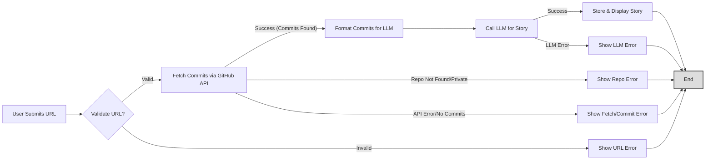

# Pocket Summarizer & Storyteller: Design Documentation

This document outlines the design and architecture of the Pocket Summarizer & Storyteller application, built using Python and Flask. It incorporates the original summarization feature and the added GitHub Story Generator. It's intended for understanding the system's components, data flow, and implementation details, potentially for LLM ingestion or developer onboarding.

## 1. Requirements

### 1.1. Core Goal
To provide a web application allowing users to:
1.  Upload multiple text-based files (`.txt`, `.md`), have them summarized cohesively by an AI model (Perplexity), and receive the final summary.
2.  Input a public GitHub repository URL, have recent commit activity analyzed by an AI model (Perplexity), and receive a short, fictional "hackathon story".

### 1.2. Key Features
*   **Multi-File Upload:** Accept multiple `.txt` and `.md` files per request for summarization.
*   **Drag & Drop Interface:** Allow users to drag files onto a designated area for uploading.
*   **AI Summarization:** Utilize the Perplexity AI API (`llama-3-sonar` models) to generate summaries.
*   **Selectable Summary Levels:** Offer "Short", "Medium", and "Comprehensive" options for the final combined summary detail.
*   **GitHub Story Generator:** Accept a public GitHub URL, fetch recent commits, and use Perplexity API (`llama-3-sonar-large`) to generate a fictional narrative.
*   **Asynchronous Processing:** Handle summarization and story generation in background threads (`threading`) to avoid blocking the web server.
*   **Live Status Updates:** Use Server-Sent Events (SSE) via Flask-SSE (Redis backend) to push real-time progress updates for both tasks.
*   **Output Views:** Display the final summary as both rendered Markdown and raw text. Display the generated story as rendered Markdown.
*   **Output Actions:** Allow users to copy the raw summary text, download it, and copy the generated story text.
*   **UI Enhancements:** Polished "Honey/Bear" theme using CSS variables, gradients, and subtle animations/transitions for improved user experience.

### 1.3. Technology Stack
*   **Backend:** Python 3
*   **Web Framework:** Flask
*   **Session Management:** Flask-Session (filesystem backend)
*   **Real-time Updates:** Flask-SSE (requires Redis backend)
*   **Background Tasks:** Python `threading` module
*   **LLM API:** Perplexity AI API (accessed via `openai` Python library compatibility mode)
*   **GitHub API:** `requests` library for fetching commit data.
*   **Markdown Processing:** `Markdown` library
*   **Frontend:** HTML5, CSS3, JavaScript (vanilla, embedded in HTML)
*   **Dependencies:** See `requirements.txt` (includes `Flask`, `openai`, `python-dotenv`, `werkzeug`, `Flask-Session`, `Flask-SSE`, `Markdown`, `redis`, `requests`)

## 2. Flow Design

The application employs two primary asynchronous request-response flows managed by Flask, background threads, and SSE.

### 2.1. Summarizer Flow
1.  **Upload (GET `/`):** User visits the main page. Renders forms.
2.  **Submit Summary (POST `/process`):**
    *   User selects/drops files, chooses summary level, submits the summarizer form.
    *   Flask (`app.py`) receives request. Validates inputs (files, level). Saves valid files to a temporary directory.
    *   Generates a unique `task_id`. Starts `run_summarizer_async` background thread, passing `task_id`, file details, level.
    *   Stores `task_id` in `session['current_summary_task_id']`. Redirects to `GET /`.
3.  **Processing Summary (GET `/` + SSE `/stream`):**
    *   Browser loads `/`. Flask sees `current_summary_task_id` in session. Checks `task_results` for this ID.
    *   If task ID exists and state is 'processing', renders page with `is_processing_summary=True`, passing `summary_task_id`.
    *   Frontend JS detects processing state, connects to SSE `/stream?channel=<task_id>`. Displays loading indicator.
4.  **Background Summarizer Execution (Thread - `run_summarizer_async`):**
    *   (Simplified logic without PocketFlow assumed here based on current `app.py`)
    *   Initializes task state in `task_results`. Publishes initial SSE status.
    *   Iterates through files: Reads content, calls `llm_caller.get_initial_summary`. Publishes SSE status updates.
    *   Combines valid summaries. Calls `llm_caller.get_combined_summary`. Publishes SSE status.
    *   Handles errors during the process.
    *   Stores final summary or error message in `task_results[task_id]['result']`. Sets state to 'completed' or 'error'. Publishes final SSE status. Cleans up temporary files.
5.  **Results Display (SSE -> Reload -> GET `/`):**
    *   Frontend JS receives 'completed'/'error' SSE message for the active task. Reloads page (`window.location.reload()`).
    *   Browser requests `GET /`. Flask sees `current_summary_task_id` in session. Checks `task_results`.
    *   Finds task ID with state 'completed'/'error'. `pop`s the results from `task_results`. Clears `task_id` from session.
    *   Renders Markdown summary to HTML (if successful). Stores raw summary in session for download.
    *   Renders template with results, `is_processing_summary=False`. Displays results section.

### 2.2. Story Generator Flow
1.  **Input (GET `/`):** User visits the main page. Renders forms.
2.  **Submit Story URL (POST `/generate_story`):**
    *   User enters public GitHub URL, submits the story form.
    *   Flask (`app.py`) receives request. Performs basic URL validation.
    *   Generates a unique `task_id`. Starts `run_story_generation_async` background thread, passing `task_id`, URL.
    *   Stores `task_id` in `session['current_story_task_id']`. Redirects to `GET /`.
3.  **Processing Story (GET `/` + SSE `/stream`):**
    *   Browser loads `/`. Flask sees `current_story_task_id` in session. Checks `task_results`.
    *   If task ID exists and state is 'processing', renders page with `is_processing_story=True`, passing `story_task_id`.
    *   Frontend JS detects processing state, connects to SSE `/stream?channel=<task_id>`. Displays loading indicator (updating text).
4.  **Background Story Execution (Thread - `run_story_generation_async`):**
    *   Initializes task state in `task_results`. Publishes initial SSE status ("Validating...").
    *   Calls `github_utils.parse_github_url`. Handles `GitHubUrlError`. Publishes SSE status ("Fetching...").
    *   Calls `github_utils.get_recent_commits`. Handles `RepoNotFoundError`, `GitHubApiError`. Publishes SSE status ("Found N commits...").
    *   Formats commit data into a string.
    *   Calls `llm_caller.get_hackathon_story`. Handles LLM errors. Publishes SSE status ("Story complete!").
    *   Handles other exceptions.
    *   Stores final story (Markdown) or error message in `task_results[task_id]['result']`. Sets state to 'completed' or 'error'. Publishes final SSE status.
5.  **Results Display (SSE -> Reload -> GET `/`):**
    *   Frontend JS receives 'completed'/'error' SSE message for the active task. Reloads page.
    *   Browser requests `GET /`. Flask sees `current_story_task_id` in session. Checks `task_results`.
    *   Finds task ID with state 'completed'/'error'. `pop`s the results. Clears `task_id` from session.
    *   Renders Markdown story to HTML (if successful).
    *   Renders template with results, `is_processing_story=False`. Displays results section.

### 2.3. Story Generator Flow Diagram

## 3. Utilities (`pocketflow_logic/utils/`)

*   **`file_handler.py`:** (Unchanged) Handles secure saving of uploaded files for summarizer, validation (count, size, type), and reading content.
*   **`llm_caller.py`:** (Updated)
    *   Interface to Perplexity AI API using `openai` library.
    *   Handles API key config, model selection (`sonar-small`, `sonar-large`), basic API error handling.
    *   Existing functions: `call_llm`, `get_initial_summary`, `get_combined_summary`.
    *   **New Function:** `get_hackathon_story(repo_name, formatted_commits_str)`: Formats the story prompt using `HACKATHON_STORY_PROMPT_TEMPLATE` and calls `call_llm` with the appropriate model (`sonar-large`).
*   **`github_utils.py`:** (New)
    *   **Purpose:** Handles interaction with the public GitHub API for fetching commit data.
    *   **Dependencies:** `requests`.
    *   **Key Functions:**
        *   `parse_github_url(url)`: Validates input is a `https://github.com/owner/repo` URL using `urllib.parse` and regex. Extracts owner/repo. Raises `GitHubUrlError` on failure.
        *   `get_recent_commits(owner, repo, days=3, limit=30)`: Fetches recent commit data (author name, date, first line of message) from the GitHub Commits API v3 using `requests`. Handles common HTTP errors (404, 403, 422) by raising specific exceptions (`RepoNotFoundError`, `GitHubApiError`) or returning an empty list. Handles network errors.

## 4. Node Design (`pocketflow_logic/nodes.py`, `flow.py`)

*   **Summarizer Task:** The current implementation in `app.py` (`run_summarizer_async`) performs the summarization steps directly within the background thread, bypassing the PocketFlow nodes (`FileProcessorNode`, `CombineSummariesNode`) defined in `nodes.py` and the flow defined in `flow.py`. If PocketFlow is desired for the summarizer, `run_summarizer_async` needs to be updated to instantiate and run the `create_summary_flow`.
*   **Story Generator Task:** This feature does not use PocketFlow. The logic is contained within the `run_story_generation_async` function in `app.py`, which calls utility functions directly.

## 5. Implementation Notes

*   **Flask Structure (`app.py`):**
    *   Defines routes: `/` (GET), `/process` (POST for summarizer), `/generate_story` (POST for story generator), `/download_summary` (GET).
    *   Configures Flask extensions (Session, SSE).
    *   Manages application context for background threads.
    *   **Background Tasks:** Uses separate functions (`run_summarizer_async`, `run_story_generation_async`) launched via `threading.Thread`.
    *   **Task Management:** Uses separate session keys (`current_summary_task_id`, `current_story_task_id`) to track active tasks.
    *   **Result Storage:** Uses a single global dictionary `task_results`, storing type, state, result, and errors keyed by `task_id`. **Not suitable for production.**
    *   **Index Route Logic:** Contains logic to check session for active tasks, query `task_results` for state/results, pop completed tasks, and pass appropriate flags/data to the template. Handles race condition by checking task state before popping.
*   **SSE (`Flask-SSE`):** Used by both background tasks to push status messages (`{'type': 'status', ...}`) and completion/error events (`{'type': 'completed'/'error', ...}`) to the frontend via the `/stream` endpoint, using the `task_id` as the channel.
*   **Frontend JS (Embedded in `index.html`):**
    *   Handles drag-and-drop for summarizer.
    *   Performs client-side validation for both forms.
    *   Manages UI state (showing/hiding loading indicator and results sections based on flags passed from Flask).
    *   Establishes SSE connection based on the active task ID passed from Flask. Updates live status text. Triggers page reload on task completion/error.
    *   Handles view toggling for summary results.
    *   Handles copy-to-clipboard functionality for summary and story.
*   **CSS (`static/style.css`):**
    *   Implements the refined "Honey/Bear" theme using CSS variables.
    *   Includes styles for layout, typography, forms, buttons, indicators, results display.
    *   Defines subtle animations (spinner, status update fade-in) and transitions (section visibility, button interactions, view toggling) using CSS `transition` and `@keyframes`.
    *   Includes `@media (prefers-reduced-motion: reduce)` query to disable animations/transitions for accessibility.
*   **Dependencies:** `requests` library added for GitHub API interaction.

## 6. Optimization & Reliability Considerations

*   **Background Tasks:** Replace `threading` with Celery/RQ for production.
*   **Result Storage:** Replace `task_results` dict with Redis/database for persistence and scalability.
*   **SSE Backend:** Ensure Redis is robust for production.
*   **Temp File Cleanup:** Summarizer cleanup happens in the thread; ensure robustness.
*   **Markdown Sanitization:** Consider `bleach` for sanitizing LLM output before rendering HTML.
*   **Error Handling:** More granular error reporting via SSE could be implemented. GitHub API rate limiting needs careful handling in a production scenario (e.g., using authenticated requests, caching).
*   **JS Complexity:** The embedded JS handling two task types is becoming complex; consider splitting into separate files or using a lightweight frontend framework for better organization if features expand further.
